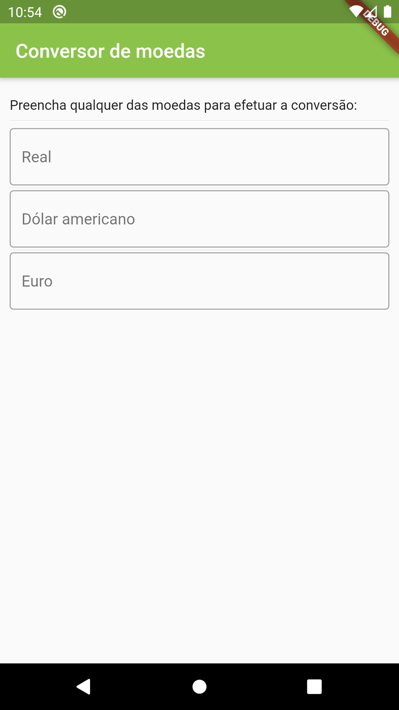
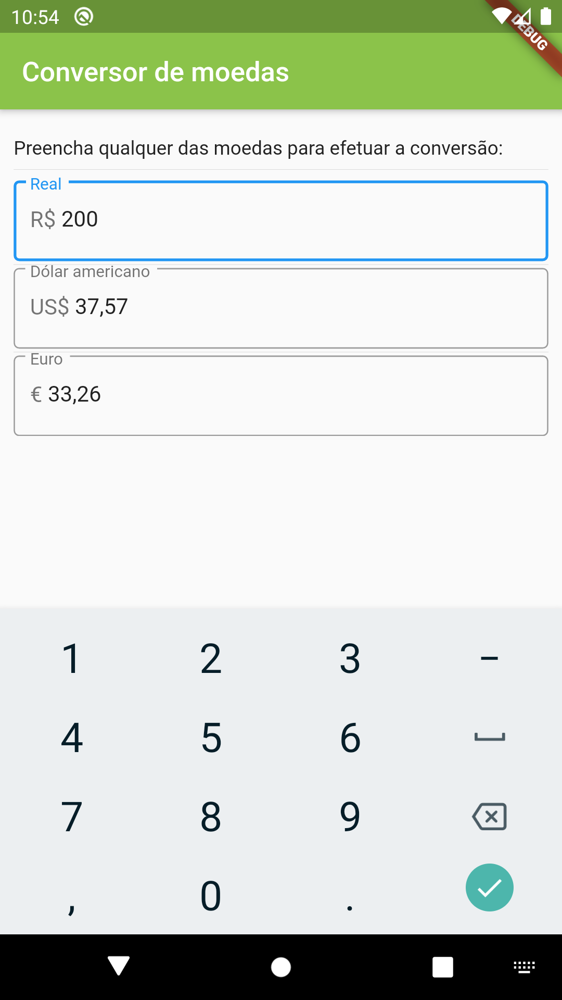

# Conversor v0.1

A simple currency converter app for both Android and iOS powered by Flutter.

## Features
 * Specify the amount on any currency and it shows the converstion for the others.
 * Supporting Real, US Dolar and Euro.
 * Available in Brazilian Portuguese.

## Screenshots
| Main view | Main view with data |
| ------------- | ------------- |
|  |  |

## Requirements
 * [Dart SDK](https://dart.dev/) between versions 2.7.0 and 3.0.0
 * [Flutter](https://flutter.dev/) 1.17.5 or above
 * [HG Finance API](https://hgbrasil.com/status/finance) key

## Built with
 * [cupertino_icons](https://pub.dev/packages/cupertino_icons) 0.1.3 or above
 * [http](https://pub.dev/packages/http) 0.12.1 or above
 * [intl](https://pub.dev/packages/intl) 0.16.1 or above

## Disclaimer
This app was made for study purposes and it's a work in progress. More features will be added in the future.

## License
This project is licensed under the MIT License - see the [LICENSE](LICENSE) file for details